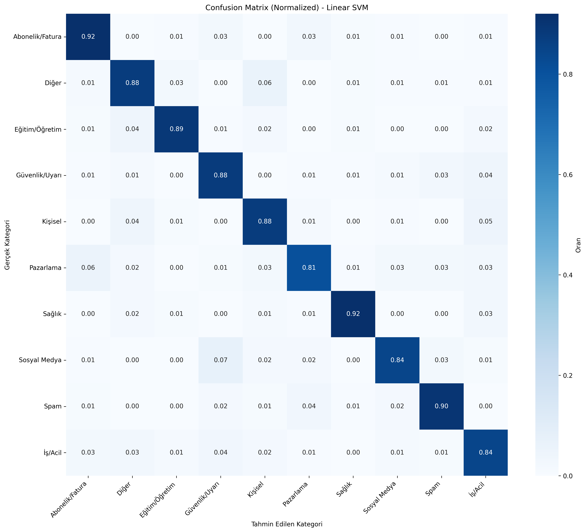

# MailMind - Email Category Classification Project

MailMind is an advanced machine learning system that intelligently categorizes email data created using Gemini AI.

> 🇹🇷 [Turkish Version](README_TR.md)

## Project Structure

### Main Files
- **mail_generator.py**: Generates email data using Gemini API
- **mail_classifier_advanced.py**: Advanced ML model training script
- **mail_classifier_model/**: Modular email classification package
  - `__init__.py`: Package exports
  - `config.py`: Configuration and constants
  - `preprocessing.py`: MetinTemizleyici and MetrikCikarici classes
  - `data_loader.py`: Data loading functions
  - `model_trainer.py`: Model training and comparison
  - `model_manager.py`: Model saving/loading
  - `predictor.py`: Prediction functions
- **testler/**: Test scripts
  - `test_model_advanced.py`: 100 test scenarios (10 categories x 10)
  - `test_interactive_advanced.py`: Interactive manual testing tool
- **mailler.csv**: Training data
- **model/**: Trained models
- **.env**: Environment variables (API key) - not added to Git
- **.gitignore**: Git ignore rules
- **requirements.txt**: Python dependencies

## Installation

### 1. Create Virtual Environment
```bash
python -m venv .venv
```

### 2. Activate Virtual Environment
```bash
# Windows PowerShell
.venv\Scripts\Activate.ps1

# Windows Git Bash
source .venv/Scripts/activate

# Linux/Mac
source .venv/bin/activate
```

### 3. Install Dependencies
```bash
pip install -r requirements.txt
```

### 4. Configure Environment Variables
```bash
# Windows PowerShell/CMD
echo GEMINI_API_KEY=your_api_key_here > .env

# Linux/Mac
echo "GEMINI_API_KEY=your_api_key_here" > .env
```

**How to Get Gemini API Key?**
1. Go to Google AI Studio: https://makersuite.google.com/app/apikey
2. Create a new API key
3. Add the API key to the `.env` file

## Usage

### 1. Data Generation (Optional)

Training data is already available in the `mailler.csv` file. If you want to generate new data:

```bash
python mail_generator.py
```

**Features:**
- ✅ 10 different categories (Business/Urgent, Marketing, Education, etc.)
- ✅ Category-specific prompt engineering
- ✅ Realistic and consistent email generation
- ✅ Daily request limit (RPD) control

### 2. Model Training

```bash
python mail_classifier_advanced.py
```

**Output:**
- ⭐ Comparison of 5 different models (Naive Bayes, Logistic Regression, Random Forest, SVM, XGBoost)
- ⚡ Speed: 3-5 minutes
- 📊 Detailed metric reports
- 🗺️ Normalized confusion matrix
- 📈 Most important features analysis
- 💾 Model files saved to `model/` folder

### 3. Model Testing

#### Interactive Test
```bash
python testler/test_interactive_advanced.py
```

Enter your own email subject and content, and view predictions.

#### Automatic Test
```bash
python testler/test_model_advanced.py
```

Evaluate your model with 100 predefined test scenarios.

#### Programmatic Usage
```python
from mail_classifier_model import tahmin_yap

baslik = "Meeting Invitation"
icerik = "A project meeting will be held tomorrow at 14:00."

tahmin, olasiliklar = tahmin_yap(baslik, icerik)
print(f"Prediction: {tahmin}")
print(f"Confidence: {olasiliklar[tahmin]:.2%}")
```

## Categories

MailMind recognizes 10 different categories:

- **İş/Acil**: Business emails and urgent notifications
- **Güvenlik/Uyarı**: Security warnings and alerts
- **Pazarlama**: Advertising and shopping emails
- **Sosyal Medya**: Social media notifications
- **Spam**: Unwanted emails
- **Abonelik/Fatura**: Membership, subscription, and invoice emails
- **Kişisel**: Personal communication and messages
- **Eğitim/Öğretim**: Education-related emails
- **Sağlık**: Health-related emails
- **Diğer**: All other categories

## Model Performance

Detailed performance analysis is performed after model training:



**Example Model Output (Linear SVM):**
- ✅ 84-92% category-wise accuracy
- ✅ Most successful categories: Sağlık (92%), Abonelik/Fatura (92%), Spam (90%)
- ✅ Most confused: Pazarlama → Abonelik/Fatura (6% confusion)
- ✅ Overall highly successful category distinction

## Model Features

### Advanced Feature Extraction
- **TF-IDF Vectorization**: 12,000 features, (1,3) ngram range
- **Metric Features**: Word count, character count, sentence count, uppercase count, punctuation count, average word length
- **Combined Feature Set**: TF-IDF + metrics

### Smart Data Cleaning
- URL, email, number removal
- Turkish stopwords filter
- Special character normalization
- Minimum text length control

### Model Algorithms
- **Naive Bayes**: Fast baseline
- **Logistic Regression**: Balanced performance
- **Random Forest**: Ensemble (50 trees)
- **Linear SVM**: Fast and effective
- **XGBoost**: Gradient boosting

### Performance
- **Training Time**: 3-5 minutes
- **Class Weights**: Data imbalance management
- **Optimized Hyperparameters**: Speed and performance balance

### Evaluation
- Accuracy, F1-Macro, Precision-Macro, Recall-Macro
- Normalized confusion matrix
- Most confused categories analysis
- Feature importance

## Model Files

After training, the model is saved in the `model/` folder:

- `mail_model_advanced.pkl` - Trained model
- `mail_vectorizer_advanced.pkl` - TF-IDF vectorizer
- `scaler_advanced.pkl` - Standard normalization
- `temizleyici_advanced.pkl` - Text cleaner
- `metrik_cikarici_advanced.pkl` - Metric extractor
- `label_to_id_advanced.npy` - Label mapping
- `id_to_label_advanced.npy` - Reverse mapping
- `metrikler_advanced.json` - Performance metrics
- `ozellik_onemleri.csv` - Most important features
- `confusion_matrix_advanced.png` - Confusion matrix

## Security

- ✅ API key stored in `.env` file
- ✅ `.env` file in `.gitignore` list
- ✅ Your personal information is not uploaded to Git

## Requirements

- Python 3.8+
- google-generativeai
- scikit-learn
- pandas, numpy
- matplotlib, seaborn
- xgboost
- python-dotenv

All dependencies are listed in the `requirements.txt` file.

## License

This project was developed for educational purposes.
