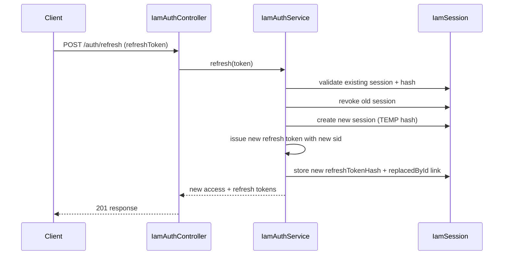

# IAM Module

Technical reference for identity, authentication, and session lifecycle in `mailmind-api`.

## Module Scope

`iam` owns user authentication and session state.

- In scope: user registration, login, access token validation, refresh token rotation, logout.
- Out of scope: mailbox sync, provider credentials, message storage.

Boundary rule: other modules do not read or write IAM tables directly; they rely on authenticated user context.

## Architecture Layers

| Layer | Folder | Responsibility |
| --- | --- | --- |
| `domain` | `src/modules/iam/domain` | Core entities (`Session`), value objects (`Email`), domain errors |
| `application` | `src/modules/iam/application` | Auth use-cases (`IamAuthService`) and token/session flow |
| `infrastructure` | `src/modules/iam/infrastructure` | Prisma repositories, Argon2 hashing, JWT issuance |
| `presentation` | `src/modules/iam/presentation/http` | HTTP controllers and `JwtAccessGuard` |

## Implemented HTTP API

Base path: `/auth`

| Endpoint | Auth | Purpose | Success Response (shape) |
| --- | --- | --- | --- |
| `POST /auth/register` | No | Create user and first session | `{ accessToken, refreshToken, expiresInSeconds }` |
| `POST /auth/login` | No | Authenticate user and issue tokens | `{ accessToken, refreshToken, expiresInSeconds }` |
| `POST /auth/refresh` | No | Rotate refresh session and return new tokens | `{ accessToken, refreshToken, expiresInSeconds }` |
| `POST /auth/logout` | No | Revoke refresh session | `{ ok: true }` |
| `GET /auth/me` | Bearer access token | Return authenticated user profile | `{ id, email, createdAt }` |

## Authentication Mechanics

1. Access token is short-lived JWT (15 minutes).
2. Refresh token is JWT tied to a DB session (`sid`) and is rotated on each successful refresh.
3. Refresh token hashes are stored, plaintext is never persisted.
4. `JwtAccessGuard` validates bearer access token and injects `req.user.id`.

### Refresh Rotation Flow

## Data Model

Source: `prisma/schema.prisma`

| Entity | Key Fields | Notes |
| --- | --- | --- |
| `IamUser` | `id`, `email`, `passwordHash`, timestamps | `email` is unique |
| `IamSession` | `id`, `userId`, `refreshTokenHash`, `expiresAt`, `revokedAt`, `replacedById` | Supports rotation chains and multi-session usage |

## Environment Variables

| Variable | Required | Used By | Purpose |
| --- | --- | --- | --- |
| `JWT_ACCESS_SECRET` | Yes | `JwtIssuerService`, `JwtAccessGuard` | Sign and verify access tokens |
| `JWT_REFRESH_SECRET` | Yes | `JwtIssuerService` | Sign and verify refresh tokens |

## Testing Coverage

Primary e2e file: `mailmind-api/test/iam.e2e-spec.ts`

Covered scenarios:

1. Register returns token pair.
2. Login with wrong password returns `401`.
3. Refresh rotation invalidates previously used refresh token.
4. Logout revokes refresh token.
5. `/auth/me` returns profile with valid bearer access token.

## Known Gaps / Next Steps

1. Global request validation pipe is not enabled in `main.ts`.
2. Rate limiting is not implemented on auth endpoints.
3. Standardized global error response format is not yet enforced.
4. Audit/security observability for auth events is minimal.
