# Mailbox Module

Technical reference for mailbox account lifecycle, sync workers, and message persistence in `mailmind-api`.

## Module Status

- Snapshot date: `2026-02-28`
- Maturity: `MVP+` (working pipeline, not fully production-hardened yet)
- Current checkpoint: account create/activate, outbox-to-sync job flow, IMAP fetch mock in e2e, `MailboxMessage` write path

## Module Scope

`mailbox` owns mailbox account linkage and synchronization primitives.

- In scope: mailbox account CRUD-like lifecycle, activation credentials, outbox event emission/consumption, sync jobs, message persistence.
- Out of scope: frontend-oriented message listing endpoints (planned), advanced delta/cursor strategy (planned), encryption at rest for IMAP password (planned).

## Implemented HTTP API

### Public health endpoint

| Endpoint | Auth | Purpose | Success Response |
| --- | --- | --- | --- |
| `GET /mailbox/health` | No | Module-level liveness check | `{ ok: true, module: "mailbox" }` |

### Authenticated mailbox account endpoints

Base path: `/mailbox/accounts` (guarded by `JwtAccessGuard`)

| Endpoint | Purpose | Success Response (shape) |
| --- | --- | --- |
| `POST /mailbox/accounts` | Create mailbox account in `PENDING` state | `{ id, userId, provider, email, displayName, status, createdAt, updatedAt }` |
| `GET /mailbox/accounts` | List mailbox accounts for current user | `Array<{ id, userId, provider, email, displayName, status, createdAt, updatedAt }>` |
| `POST /mailbox/accounts/:id/activate` | Attach OAuth or IMAP credentials, set account `ACTIVE`, emit outbox event | account summary object |
| `POST /mailbox/accounts/:id/revoke` | Remove credentials, set account `REVOKED`, emit outbox event | account summary object |

## Sync Architecture and Data Flow

```mermaid
flowchart LR
  A[POST /mailbox/accounts/:id/activate] --> B[MailboxAccountsService]
  B --> C[OutboxEvent type=MAILBOX_ACCOUNT_CONNECTED status=PENDING]
  C --> D[OutboxWorkerService processOnce]
  D --> E[MailboxSyncWorkerService enqueueForMailbox]
  E --> F[MailboxSyncJob status=PENDING]
  F --> G[MailboxSyncWorkerService processOnce]
  G --> H[ImapProvider fetchRecent]
  H --> I[Upsert MailboxMessage by mailboxAccountId+providerMessageId]
  I --> J[MailboxSyncJob status=DONE or FAILED]
```

## Worker Behavior

### Outbox worker

- Polls `OutboxEvent` where status is `PENDING`.
- Marks event `PROCESSING`.
- Handles `MAILBOX_ACCOUNT_CONNECTED` by enqueueing mailbox sync.
- Marks event `DONE` on success, `FAILED` on error.

### Sync worker

- Polls `MailboxSyncJob` where status is `PENDING`.
- Marks job `RUNNING`.
- Fetches recent messages from provider (`limit: 50` in current MVP path).
- Upserts rows into `MailboxMessage`.
- Marks job `DONE` on success, `FAILED` on failure.
- Prevents duplicate active jobs by mailbox (`PENDING` or `RUNNING` guard in enqueue).

## Data Model (Mailbox-focused)

Source: `prisma/schema.prisma`

| Entity | Key Fields | Notes |
| --- | --- | --- |
| `MailboxAccount` | `id`, `userId`, `provider`, `email`, `status` | Unique `(provider, email)` |
| `MailboxCredential` | `mailboxAccountId`, OAuth fields, IMAP fields | One-to-one with `MailboxAccount` |
| `OutboxEvent` | `type`, `payload`, `status`, `createdAt`, `sentAt` | Async event bridge for side effects |
| `MailboxSyncJob` | `mailboxAccountId`, `type`, `status`, `cursor`, timestamps | Tracks sync pipeline execution |
| `MailboxMessage` | `mailboxAccountId`, `providerMessageId`, `folder`, headers, `snippet` | Unique `(mailboxAccountId, providerMessageId)` |

## Testing

Primary e2e file: `mailmind-api/test/mailbox.e2e-spec.ts`

Current e2e validates:

1. Mailbox create and activate endpoints via authenticated user.
2. Outbox worker and sync worker deterministic processing (`processOnce` loops).
3. Sync job creation and transition to `DONE`.
4. IMAP provider is overrideable/mocked in test module setup.
5. Revoke endpoint path is reachable and event flow remains processable.

Current e2e does not yet assert stored `MailboxMessage` count/provider ID; that is the first roadmap hardening step below.

## Operational Notes

| Variable | Default | Effect |
| --- | --- | --- |
| `WORKERS_ENABLED` | `true` | Enables interval-driven workers; e2e sets `false` and drives workers manually |
| `OUTBOX_WORKER_INTERVAL_MS` | `1000` | Poll frequency for outbox processing |
| `MAILBOX_SYNC_WORKER_INTERVAL_MS` | `1000` | Poll frequency for mailbox sync job processing |

## Current Limitations

1. IMAP password uses `PLAINTEXT:` placeholder wrapping in current code path.
2. Sync path is recent-window based (`fetchRecent`) and not true delta yet.
3. Message read APIs are not exposed yet.
4. Worker retry/backoff and stuck-job recovery are not implemented yet.

## Mailbox Roadmap (Prod-Ready Path)

Current baseline for this roadmap:

- Account create is working.
- Account activate is working.
- Outbox worker and sync worker pipeline is wired.
- `MailboxMessage` persistence path is working.
- e2e uses provider override/mock and verifies sync job `DONE`.

### Step 0 - Stabilize current state (1 hour)

Expected output:

- MVP flow is deterministic in e2e and validates message write.

Work items:

- [ ] Add mailbox message assertions in e2e.
- [ ] Assert `MailboxMessage.count > 0`.
- [ ] Assert `providerMessageId = INBOX:101` exists.
- [ ] Extract mock provider override into helper for readability.
- [ ] Remove temporary debug logs.

Verification:

- `npm run test:e2e`

### Step 1 - API surface: message listing (1-2 days)

Expected output:

- Frontend-readable message APIs are available.

Work items:

- [ ] Implement `GET /mailbox/:mailboxId/messages`.
- [ ] Add pagination (`cursor` or `page/limit`).
- [ ] Default sort by `date desc`.
- [ ] Add filter `folder=INBOX` (MVP).
- [ ] Implement `GET /mailbox/:mailboxId/messages/:messageId` detail endpoint.
- [ ] Keep response contract stable via DTOs.

Verification:

- e2e: run mock sync, then fetch messages through endpoint and assert payload.
- unit: repository query tests.

### Step 2 - Convert sync pipeline to incremental/delta (2-4 days)

Expected output:

- Sync fetches only new messages instead of repeatedly pulling recent window.

Work items:

- [ ] Define UID-based cursor strategy (`INBOX:<lastUid>`).
- [ ] Extend provider interface with `fetchDelta({ mailboxAccountId, folder, cursor, limit })`.
- [ ] Implement `UID > lastUid` filtering in IMAP provider.
- [ ] Update cursor in a single authoritative place when job finishes `DONE`.

Verification:

- unit: provider tests with mocked IMAP client.
- e2e: two sync rounds; second round with no new messages must not increase count.

### Step 3 - Worker robustness (2-3 days)

Expected output:

- Job lifecycle survives production race/failure patterns.

Work items:

- [ ] Ensure concurrency guard prevents duplicate running jobs per mailbox.
- [ ] Add retry/backoff fields (`attemptCount`, `nextRunAt`) and behavior.
- [ ] Add stuck-job recovery for stale `RUNNING` jobs.
- [ ] Add structured logs and job metrics (count/duration/failure rate).

Verification:

- unit: no enqueue when `RUNNING` exists.
- e2e: stale `RUNNING` job simulation and recovery behavior.

### Step 4 - Credential security (2-5 days)

Expected output:

- `PLAINTEXT:` path is fully removed.

Work items:

- [ ] Add `CredentialCipher` service (AES-GCM or equivalent).
- [ ] Store encrypted blob in `imapPasswordEnc`.
- [ ] Encrypt on activate and decrypt in provider path.
- [ ] Define future key rotation/versioning strategy.

Verification:

- unit: encrypt/decrypt roundtrip.
- e2e: provider decrypt path works under mock IMAP flow.

### Step 5 - Enrich message model (3-7 days)

Expected output:

- Data model supports richer product features.

Work items:

- [ ] Add `messageId` (RFC Message-ID header) when available.
- [ ] Add optional `replyTo`, `cc`, `bcc`.
- [ ] Add message flags (`seen`, `flagged`).
- [ ] Support multi-folder semantics.
- [ ] Add initial `threadKey` strategy.
- [ ] Decide body strategy option A: full body in DB for low volume.
- [ ] Decide body strategy option B: fetch-on-demand for scale.

Verification:

- migration tests and query tests.

### Step 6 - Multi-provider architecture (2-4 days)

Expected output:

- Adding Gmail/Graph providers becomes straightforward.

Work items:

- [ ] Introduce `MailProviderFactory` keyed by `MailboxAccount.provider`.
- [ ] Standardize provider interface methods (`fetchDelta`, `fetchBody`, `send`).
- [ ] Refactor IMAP provider selection to factory usage.

Verification:

- unit: provider selection and dispatch tests.

### Step 7 - Module done criteria (Mailbox closure gate)

Mailbox is considered done when all are true:

- [ ] Message list endpoint with pagination is live.
- [ ] Delta sync with cursor is live.
- [ ] Worker retry and stuck-job recovery are live.
- [ ] Credential encryption is live (`PLAINTEXT` removed).
- [ ] e2e validates sync `DONE`, message persistence, and message list contract.
- [ ] Basic docs cover endpoint contracts, job status lifecycle, and cursor rules.

## Recommended Execution Order

1. Step 0: e2e assertions and cleanup.
2. Step 1: message list endpoints.
3. Step 2: delta sync.
4. Step 3: worker robustness.
5. Step 4: credential encryption.
6. Step 6: provider factory (when additional provider pressure appears).
7. Step 5 body/attachment expansion (when product needs require larger payload features).
